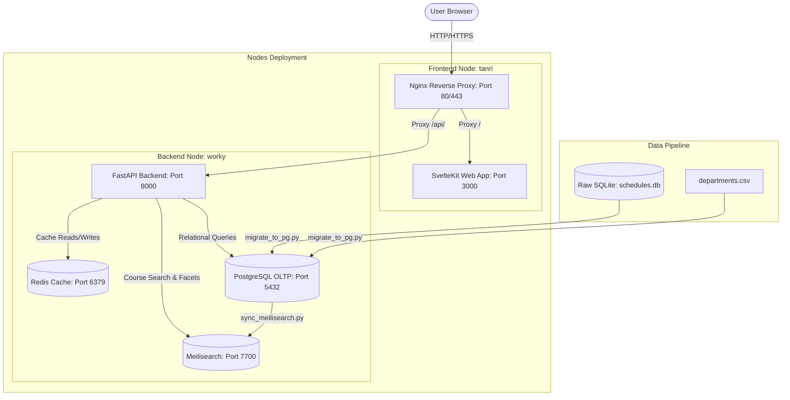
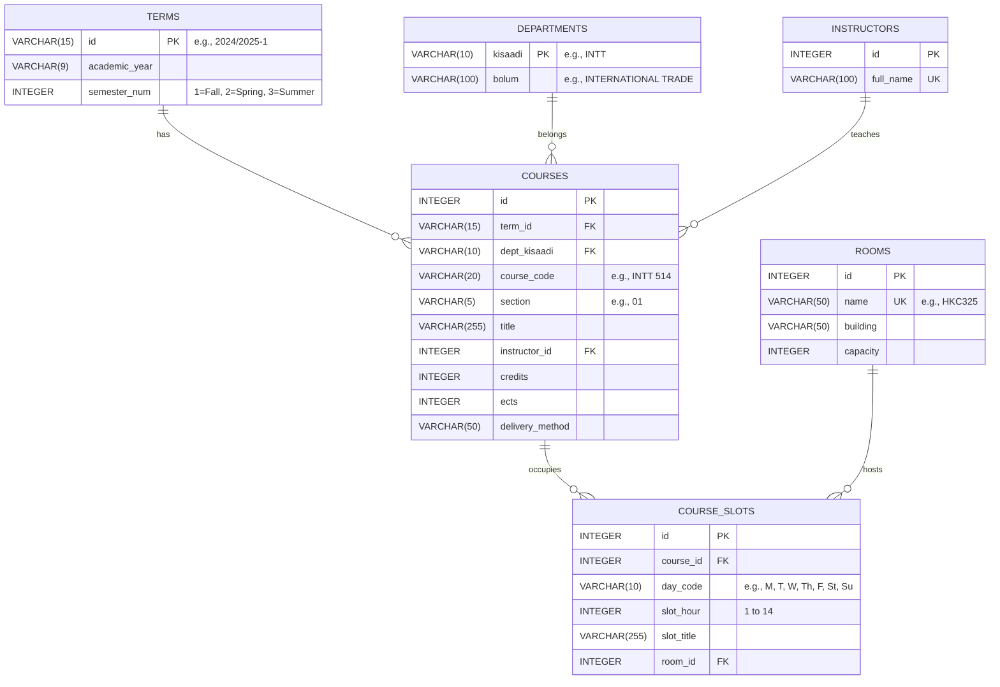
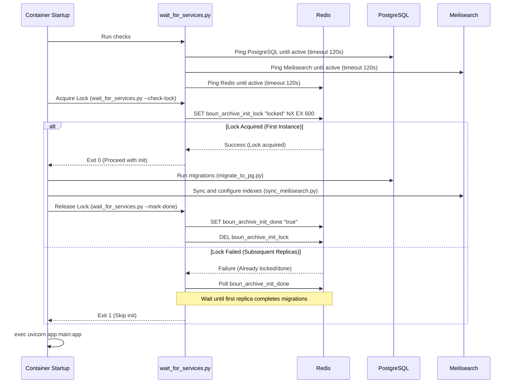

# BOUN Archive: Historical Course Scheduling & Academic Analytics Platform

An advanced academic analytics platform designed to analyze, visualize, and forecast course scheduling trends at Bogazici University. Drawing from a historical dataset of over **140,000 course slots** spanning **50+ years**, the platform offers longitudinal research capabilities (e.g., department growth, delivery methods shift, instructor legacies) and predictive scheduling (offering probabilities and slot predictions).

---

## 1. System Architecture

The BOUN Archive is designed as a distributed microservice system, containerized via Docker and optimized for both local development (`docker-compose`) and production high-concurrency deployment (Docker Swarm/Dokploy).



### Infrastructure Nodes
*   **`tanri` (Public-Facing Node)**: Hosts the Nginx reverse proxy and the SvelteKit frontend replicas. Optimized for network throughput and SSL termination.
*   **`worky` (Data & Computational Node)**: Hosts the FastAPI app, PostgreSQL database, Meilisearch engine, and Redis cache. Optimized for CPU-heavy calculations and high-speed memory/disk IO.

---

## 2. Technology Stack

### Frontend Architecture
*   **SvelteKit (v2) & Svelte (v5)**: Uses the modern Svelte 5 "Runes" system (`$state`, `$derived`, `$effect`) for reactive client-side rendering.
*   **Tailwind CSS (v4)**: Implements dynamic modern layouts with custom glassmorphism and native dark mode support (toggled via `document.documentElement.classList`).
*   **ChartJS & LayerChart**: Visualizes department growth trajectories, weekly scheduling grids, and historical statistics.
*   **Bun**: Serves as the package manager, compiler, and server runtime inside the frontend runner container.

### Backend & Analytics Engine
*   **FastAPI (Python)**: High-performance ASGI framework serving API requests, featuring Gzip compression and CORS middleware.
*   **SQLAlchemy (v2)**: Implements an Object-Relational Mapper (ORM) with connection pooling (`pool_size=20`, `max_overflow=10`, `pool_recycle=3600`) and robust relationships.
*   **Redis & FastAPI-Cache**: Caches API responses (from 10 minutes to 24 hours depending on the request type) to drastically reduce database overhead.
*   **Pandas & NumPy**: Drives the core statistical Trend Engine (prediction algorithms).

### Search & Database
*   **PostgreSQL (v16)**: Primary relational database containing normalized academic data. Production instances are tuned with resource reservations (2GB RAM min, 4GB limit) and DB cache settings (`shared_buffers=2GB`, `effective_cache_size=6GB`).
*   **Meilisearch (v1.12)**: Serves full-text searchable course registries with ultra-low latency, offering faceted counts for semesters, departments, and delivery methods.

---

## 3. Database Schema

The implementation normalized the raw scraped data into a structured relational schema in PostgreSQL:



---

## 4. Ingestion & Initialization Pipeline

To spin up the system reliably in multi-replica production environments (like Docker Swarm), the startup pipeline is strictly synchronized using a **Redis-based Distributed Lock**:



1.  **Migration (`scripts/migrate_to_pg.py`)**: Migrates raw SQL rows from SQLite `schedules.db` and the CSV metadata in `departments.csv` into PostgreSQL. It performs entity resolution, such as mapping instructor names and rooms, sanitizing spaces in course codes, and bulk-saving records.
2.  **Indexing (`scripts/sync_meilisearch.py`)**: Queries PostgreSQL with optimized `joinedload` operators, maps relational objects into a flat document structure, and pushes documents in chunks of 1,000 into Meilisearch. It configures searchable attributes, filterable attributes, facets, and sort attributes.

---

## 5. Core Computational Engines

### A. The Trend Engine (Predictive Analytics)
Located in `backend/app/analytics.py`, this engine forecasts the offering probability and slot placement of courses.
*   **Temporal Availability Probability**: Evaluates historical course data over a 5-year lookback window. Instead of a simple average, it applies an **exponential decay function** ($\lambda = 0.3$) to weight recent curricular schedules higher than older ones:
    $$W = e^{-\lambda \cdot \Delta t}$$
    Where $\Delta t$ is the age of the academic year relative to 2026. This allows predictions to quickly adjust to recent department reforms.
*   **Time Slot Confidences**: Collects all historical slots for a course, applies the same decay weighting to each occurrence, aggregates weights by `(day_code, slot_hour)`, and outputs the top 3 slot combinations normalized by confidence scores.

### B. The Ghost Schedule Engine (Campus Time Machine)
*   Rebuilds the physical state of the campus for any historical semester.
*   Aggregates courses and their slots for a given term, maps them to their respective rooms, and formats them into a 2D matrix (Rooms vs. Hours 1–14) for a selected day. This highlights structural building under-utilization or scheduling bottlenecks.

### C. The Macro Engine (University Evolution)
*   **Department Evolution**: Aggregates the volume of course sections per department over the last 50 years to show the rise/decline of specific departments.
*   **Delivery Evolution**: Tracks the adoption of `Online`, `Hybrid`, and `Face-to-Face` formats across semesters.
*   **Scheduling Heatmaps**: Generates global scheduling density matrices, filterable by decade, showing standard hour preferences (e.g., peak lecture hours).
*   **Course Lifecycles**: Classifies courses into **New Horizons** (first offered within the last 2 years) and **Graveyard** (not offered in over 10 years).

---

## 6. API Interface

All endpoints are prefix-rewritten under `/api/` by Nginx and proxy-passed to the FastAPI backend.

| Endpoint | Cache TTL | Description |
| :--- | :--- | :--- |
| `GET /v1/search?q=...` | 10 mins | Full-text search on Meilisearch with term/dept facets and sorting. |
| `GET /v1/facets` | 1 hour | Retrieves global facet distributions for filters. |
| `GET /v1/analytics/ghost-schedule/{term}` | 1 hour | Returns full room-to-slot allocations for the given semester. |
| `GET /v1/predict/course/{course_code}` | 1 hour | Predicts offering probabilities and time slots. |
| `GET /v1/analytics/instructor/{id}/legacy` | 1 hour | Retrieves legacy DNA metrics and timeline for an instructor. |
| `GET /v1/analytics/macro/departments-evolution`| 24 hours | Time-series data of department sizes. |
| `GET /v1/analytics/macro/delivery-evolution` | 24 hours | Time-series data of lecture delivery methods. |
| `GET /v1/analytics/macro/scheduling-heatmap` | 24 hours | Global scheduling hours heatmap. |
| `GET /v1/analytics/macro/course-lifecycles` | 24 hours | Classifications of active, new, and extinct courses. |

---

## 7. Running the Project Locally

### Prerequisites
*   Docker & Docker Compose

### Start Services
1.  Create a `.env` file in the root directory (based on `docs/environment-variables.md`):
    ```env
    POSTGRES_USER=boun_user
    POSTGRES_PASSWORD=boun_password
    POSTGRES_DB=boun_archive
    DB_PORT=5432
    DATABASE_URL=postgresql://boun_user:boun_password@db:5432/boun_archive

    MEILI_MASTER_KEY=masterKeyLongEnough123
    MEILI_ENV=development
    MEILI_PORT=7700
    MEILI_URL=http://meilisearch:7700

    REDIS_URL=redis://redis:6379

    BACKEND_PORT=8000
    FRONTEND_PORT=3000
    PUBLIC_API_URL=http://localhost/api
    ```
2.  Start the entire stack:
    ```bash
    docker compose up --build
    ```
3.  Access the web application at `http://localhost`.

---

## 8. Expert Developer Insights & Enhancement Opportunities

### Architectural Discrepancies
*   **Database Schema vs. Initial Specs**: The initial specification in `BOUN-ARCHIVE-SPEC.md` defined `room` as a plain `VARCHAR(50)` directly inside the `course_slots` table. The implementation correctly refactored this into a fully normalized `rooms` table (`id`, `name`, `building`, `capacity`) with a foreign key `room_id` on `course_slots`. This significantly increases data integrity and allows rooms to easily store metadata like buildings and capacities.

### Identified Bottlenecks & Optimization Areas
1.  **Trend Engine Memory Loading**: Currently, the `/v1/predict/course/{course_code}` endpoint loads database results into Pandas DataFrames on every call to perform prediction logic. While using Pandas is appropriate for batch operations, spinning up Pandas DataFrames on the fly for single-course calculations in web request threads introduces CPU overhead.
    *   *Recommendation*: Refactor the prediction mathematical logic into pure Python/NumPy or calculate probabilities directly inside SQL window functions to improve latency under load.
2.  **Meilisearch Sync Memory Footprint**: In `sync_meilisearch.py`, all courses are fetched into memory at once with `session.query(Course).all()`. With over 140,000 records and related objects joined via `joinedload`, this consumes a large memory chunk on startup.
    *   *Recommendation*: Refactor Meilisearch indexing to use SQLAlchemy's `yield_per()` or batch offsets to query records in chunks, keeping memory utilization flat.
3.  **Static Data Caching**: Macro metrics (lifecycles, heatmap, and evolutions) compile data spanning 50 years which is static for the duration of a semester. The API correctly utilizes a 24-hour cache limit (`expire=86400`) in Redis, which is critical to avoid slow database scans on SQLite/PostgreSQL.
