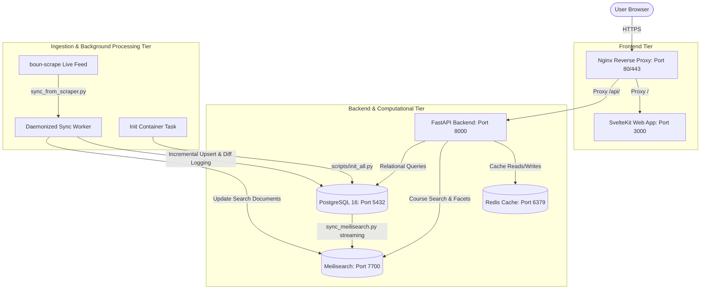

# BOUN Archive: System Architecture & Technical Specifications

This document describes the technical architecture, database schemas, background pipelines, and performance constraints of the BOUN Archive platform.

---

## 1. High-Level System Architecture

The BOUN Archive is structured as a containerized microservice system optimized for Docker Compose and Dokploy deployments.

---

## 2. Component Breakdown

### A. Frontend Layer (`frontend/`)
* **Framework**: SvelteKit 2 running Svelte 5 with reactivity runes (`$state`, `$derived`, `$effect`, `$props`).
* **Runtime & Package Manager**: Bun 1.x.
* **Styling**: Tailwind CSS v4 with dark mode and custom scrollbar utilities.
* **Visualization**: Chart.js for historical departmental credit evolution.
* **Responsive Layouts**: Off-canvas mobile navigation drawer, sticky timetable matrix hour/room columns, and mobile card view transforms.

### B. Backend API Layer (`backend/`)
* **Framework**: FastAPI (Python 3.11) with Uvicorn ASGI server.
* **ORM & Database**: SQLAlchemy 2.0 connected to PostgreSQL 16.
* **Caching**: `fastapi-cache` backed by Redis 7. Expiry rules:
  - Macro analytics: `86400`s (24 hours)
  - Search & active directory queries: `600`s (10 minutes)
  - Unready service index states bypass caching via `HTTPException(503)`.
* **Search Engine**: Meilisearch 1.12 providing low-latency full-text course search and dynamic facet counts.

---

## 3. Core Analytical Engines

### 1. The Macro Engine (`backend/app/analytics.py`)
Computes departmental credit distributions, offering trends, and classroom scheduling heatmaps natively via PostgreSQL SQL queries without Python-level data aggregation overhead.

### 2. The Ghost Schedule Engine (`backend/app/analytics.py`)
Reconstructs building and room utilization matrices for any historical term across a 14-hour daily grid using indexed dictionary lookups for instantaneous client-side rendering.

### 3. Live Quota & Change Tracking Engine (`scripts/sync_from_scraper.py`)
Tracks section capacity snapshots (`quota_snapshots`) and records audit logs of schedule modifications, cancellations, and classroom reassignments (`course_changes`).

---

## 4. Architectural Invariants & Best Practices

| Area | Production Rule | Reason |
| :--- | :--- | :--- |
| **Live Sync Ingestion** | Use `scripts/sync_from_scraper.py` with natural composite key `(term_id, dept_kisaadi, course_code, section)`. | Prevents destructive drops and avoids duplicating section instances during live updates. |
| **Meilisearch Streaming** | Use `selectinload(Course.slots).joinedload(CourseSlot.room)` with `.yield_per(chunk_size)`. | Prevents SQLAlchemy `InvalidRequestError` while eliminating N+1 queries across 136k+ course instances. |
| **Container Multi-Targeting** | Preserve `if [ "$#" -gt 0 ]; then exec "$@"; fi` in `backend/entrypoint.sh`. | Allows one-off migration and sync CLI executions without starting the full uvicorn web server. |
| **SvelteKit Runtime Env** | Use `$env/dynamic/public` with default fallbacks instead of static env imports. | Enables container images to compile cleanly even if public env vars are omitted at build-time. |
| **Client API Resolution** | Fallback to `/api` when `PUBLIC_API_URL` contains loopback/internal hosts on remote clients. | Prevents remote mobile devices and external clients from attempting to query device-local loopback ports. |
| **Resilient Hydration** | Use `Promise.allSettled` and safe `res.ok` checks with baseline constants in client fetchers. | Prevents single-endpoint or Meilisearch warm-up failures from wiping out dashboard metrics to `0`. |
| **Responsive Matrix Panes** | Keep sticky left columns for Room / Hour in timetable and ghost schedule matrices. | Ensures critical row identifiers remain legible while panning wide 14-hour grids on mobile screens. |

