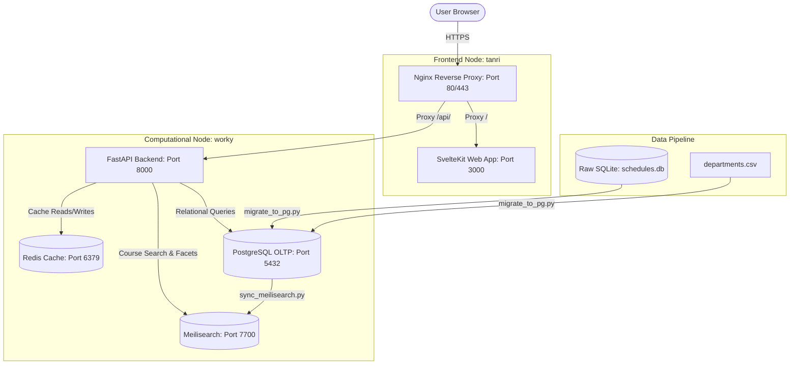

# BOUN Archive: System Architecture & Technical Specifications

This document describes the technical architecture, database schemas, background pipelines, and performance constraints of the BOUN Archive platform.

---

## 1. High-Level System Architecture

The BOUN Archive is structured as a containerized microservice system optimized for Docker Swarm and Dokploy deployments.

---

## 2. Component Breakdown

### A. Frontend Layer (`frontend/`)
* **Framework**: SvelteKit 2 running Svelte 5 with reactivity runes (`$state`, `$derived`, `$effect`, `untrack`).
* **Package Manager**: Bun 1.x.
* **Styling**: Tailwind CSS v4 with dark mode and custom scrollbar utilities.
* **Visualization**: Chart.js & LayerChart for historical trend analysis.

### B. Backend API Layer (`backend/`)
* **Framework**: FastAPI (Python 3.11) with Uvicorn ASGI server.
* **ORM & Database**: SQLAlchemy 2.0 connected to PostgreSQL 16.
* **Caching**: `fastapi-cache` backed by Redis 7. Expiry rules:
  - Macro analytics & static trends: `86400`s (24 hours)
  - Search & active directory queries: `600`s (10 minutes)
* **Search Engine**: Meilisearch 1.12 providing low-latency full-text course search and dynamic facet counts.

---

## 3. Core Analytical Engines

### 1. The Trend Engine (`backend/app/analytics.py`)
Predicts section offering probabilities and time slots using exponential time-decay weighting ($\lambda = 0.3$) over a 5-year lookback window:
$$W = e^{-\lambda \cdot \Delta t}$$
where $\Delta t = 2026 - \text{year}$.

### 2. The Ghost Schedule Engine (`backend/app/analytics.py`)
Reconstructs building and room utilization matrices for any historical term across a 14-hour daily grid.

### 3. The Commute Risk Engine (`frontend/src/routes/calendar/`)
Evaluates user weekly schedules for back-to-back cross-campus transitions (e.g., North Campus to Kilyos Saritepe Campus) and flags high-risk commute bottlenecks.

---

## 4. Identified Architectural & Scaling Bottlenecks

| Area | Current Implementation Bottleneck | Architectural Fix / Recommendation |
| :--- | :--- | :--- |
| **Data Ingestion Memory** | `scripts/sync_meilisearch.py` loads all courses into memory with `.all()`. | Stream database records using `.yield_per(1000)` batching. |
| **Database Migrations** | `scripts/migrate_to_pg.py` loads SQLite tables into Pandas DataFrames. | Replace Pandas with direct `sqlite3` cursor streaming. |
| **Python Aggregations** | Endpoints like `/v1/analytics/instructor/{id}/legacy` instantiate ORM objects and aggregate via `Counter` in Python. | Move aggregations to SQL `GROUP BY` subqueries in PostgreSQL. |
| **Frontend SSR & Loading** | Pages use client-side `onMount` fetches rather than SvelteKit `load` functions. | Migrate initial page data fetching to SvelteKit `+page.ts` load functions. |
| **Search Race Conditions** | Debounced search in `search/+page.svelte` lacks an `AbortController`. | Wrap fetch calls in `AbortController` signal handlers. |
