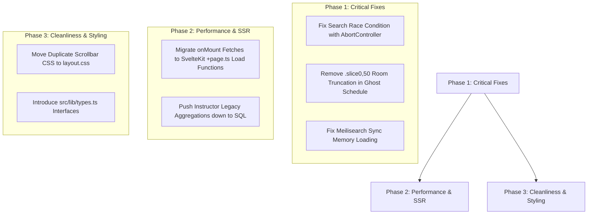

# BOUN Archive: Feature Set Audit & Refactoring Roadmap

This document evaluates the feature set of the BOUN Archive platform, categorizing working features, broken or truncated features, and redundant or sub-optimal patterns across frontend and backend codebases.

---

## 1. Feature Set Status Matrix

| Feature Module | Route / Endpoint | Current Status | Assessment & Operational Notes |
| :--- | :--- | :--- | :--- |
| **Search Directory** | `/search` `GET /v1/search` | **Working (Needs Fix)** | Full-text Meilisearch integration works with URL parameters, facets, and CSV export. **Issue**: Debounced input lacks `AbortController`, creating race conditions on fast typing. |
| **Weekly Planner (Calendar)** | `/calendar` | **Working** | Svelte 5 `$state` with `untrack()` local storage persistence. Features "Dash of Death" inter-campus commute warnings. |
| **Historical Trends Engine** | `/trends` `GET /v1/analytics/macro/*` | **Working** | Visualizes department growth, delivery formats, and scheduling heatmaps via Chart.js. Properly cancels inflight fetches with `AbortController`. |
| **Ghost Schedule Engine** | `/ghost-schedule` `GET /v1/analytics/ghost-schedule/{term}` | **Truncated / Buggy** | Reconstructs room allocation matrices. **Bug**: Frontend explicitly truncates the room table with `.slice(0, 50)`, hiding 80%+ of campus classrooms from users. |
| **Instructor Legacy DNA** | `/instructor/[id]` `GET /v1/analytics/instructor/{id}/legacy` | **Sub-optimal Performance** | Calculates legacy metrics (most taught courses, preferred slots). **Performance Issue**: Aggregations are calculated in Python memory using `Counter` instead of PostgreSQL `GROUP BY`. |
| **Course Offering Predictor** | `/course/[code]` `GET /v1/predict/course/{course_code}` | **Working (Edge Case)** | Calculates offering probabilities using exponential decay weighting ($\lambda = 0.3$). **Edge Case**: Extinct courses scaling back lookback windows can report false high confidences. |
| **Departments Directory** | `/departments` `GET /v1/facets` | **Working** | Lists all academic departments and course counts. |

---

## 2. Issues & Unneeded / Bad Implementations

### A. Frontend Anti-Patterns & Deficiencies
1. **Client-Only Fetching (Missing SvelteKit `load`)**:
   - Initial page loads fetch data client-side inside `onMount` or `$effect`.
   - *Impact*: Forfeits Server-Side Rendering (SSR), SEO, and fast parallelized route pre-loading.
2. **Ghost Schedule Room Matrix Truncation**:
   - `ghost-schedule/+page.svelte` truncates output using `rooms.slice(0, 50)`.
   - *Impact*: Users cannot view schedules for classrooms beyond the first 50.
3. **Duplicated Utility CSS**:
   - `.custom-scrollbar` and `.no-scrollbar` classes are copy-pasted into `<style>` tags across 5+ route files.
   - *Fix*: Centralize inside [`frontend/src/routes/layout.css`](file:///home/devhax/projects/fusuyfusuy/boun-archive/frontend/src/routes/layout.css).
4. **Loose TypeScript Typing**:
   - Ubiquitous use of `$state<any>()` and implicit `any` in API handling.
   - *Fix*: Define typed contracts in `frontend/src/lib/types.ts`.

### B. Backend Bottlenecks & Inefficiencies
1. **In-Memory Meilisearch Indexing**:
   - [`scripts/sync_meilisearch.py`](file:///home/devhax/projects/fusuyfusuy/boun-archive/scripts/sync_meilisearch.py) loads the entire `Course` table into RAM with `.all()` prior to chunking.
   - *Fix*: Replace with `.yield_per(1000)` streaming.
2. **Python-Side Aggregations**:
   - Instructor legacy calculations pull raw records into Python memory and run loops with `Counter`.
   - *Fix*: Refactor to SQL `GROUP BY` subqueries in PostgreSQL.
3. **Filter Escaping**:
   - Manual single-quote replacement in Meilisearch filter string building (`main.py`).
   - *Fix*: Pass structured filter arrays.

---

## 3. Recommended Refactoring Roadmap

